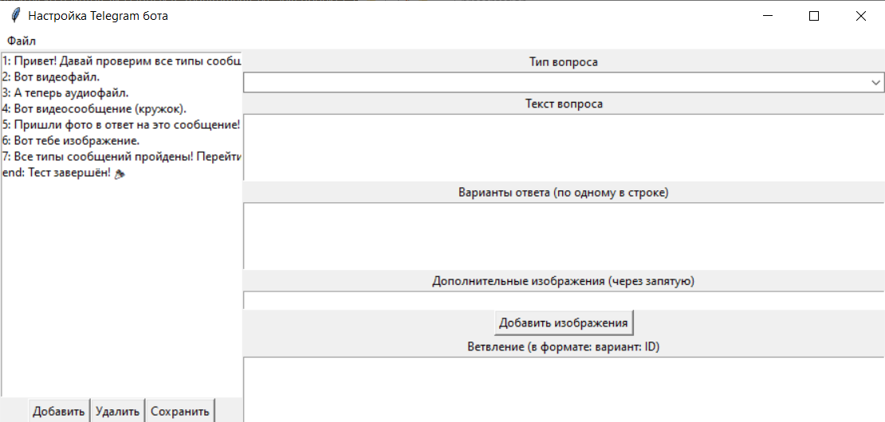

# JSONChatBot

## Описание проекта
Система чат-бота с гибкой настройкой диалоговых сценариев через JSON-файлы.  
Позволяет создавать интерактивные диалоги с различными типами сообщений и управлять логикой переходов между вопросами, редактируя простой JSON.

---

## Быстрый старт

1. Клонируйте репозиторий:
   ```bash
   git clone https://github.com/ChornyChay1/JSONChatBot.git
   cd JSONChatBot
   ```
2. Установите зависимости:
   ```bash
   pip install -r requirements.txt
   ```
   
2. Установите зависимости:
Создайте файл secret.py и укажите там необходимые переменные:
    ```python
API_TOKEN =  #токен бота взять из BotFather
DATABASE_URL = "sqlite+aiosqlite:///bot_data.db" #можно сменить название базы данных или её саму
APPROVAL_CHAT_ID = "-1002375623822" #Telegram-ID модератора, который будет проверять отчёты для фото-вопросов
  ```
3. Настройте под себя questions.json:
   Пример синтаксиса:
      ```json
    {
      "1": {
        "type": "text",
        "question": "Привет! Давай проверим все типы сообщений. Готов?",
        "options": [ "Да", "Нет" ],
        "branching": true,
        "branches": {
          "Да": "2",
          "Нет": "end"
        }
      },
      "2": {
        "type": "video",
        "question": "Вот видеофайл.",
        "video_file": "files/test_video.mp4",
        "options": [ "➡️" ],
        "branching": true,
        "branches": {
          "➡️": "3"
        }
      },
    ```

## Поддерживаемые типы вопросов

| Тип          | Описание                                  |
|--------------|-------------------------------------------|
| `text`       | Текстовое сообщение с вариантами ответов |
| `video`      | Видео с подписью и кнопками               |
| `audio`      | Аудио с подписью и кнопками               |
| `video_note` | Видеосообщение в формате видеозаметки (круг) |
| `photo`      | Запросить у пользователя прислать фото   |
| `image`      | Отправить изображение с подписью          |
| `end`        | Завершение диалога                        |

---

## Утилита для ручного редактирования JSON

Для удобного создания и редактирования диалоговых сценариев предусмотрена графическая утилита на основе библиотеки **tkinter**.  
Она позволяет визуально работать с вопросами, ветвлениями и медиафайлами, облегчая настройку сложных диалогов.

### Основные возможности утилиты:

- Просмотр списка вопросов с возможностью выбора.
- Добавление новых и удаление существующих вопросов.
- Редактирование текста вопроса, вариантов ответов и правил ветвления.
- Выбор типа вопроса (`text`, `video`, `audio`).
- Загрузка и копирование в проект медиафайлов (видео, аудио, изображения).
- Сохранение и загрузка JSON-файлов с диалогами.

---

### Запуск утилиты

Для запуска утилиты необходимо установить tkinter (если он ещё не установлен).
```bash
sudo apt-get install python3-tk
python settings-server.py
```

### Интерфейс утилиты
<p align="center">
  
</p>

## Используемые технологии

- **Python 3** — основной язык разработки проекта  
- **Aiogram** — асинхронная библиотека для создания Telegram-ботов  
- **Pydantic** — для валидации и парсинга данных JSON в питоновские модели  
- **SQLAlchemy** — ORM для работы с базой данных SQLite (асинхронно через `aiosqlite`)  
- **Tkinter** — стандартная библиотека Python для создания графического интерфейса, используется для утилиты ручного редактирования JSON-сценариев

---
